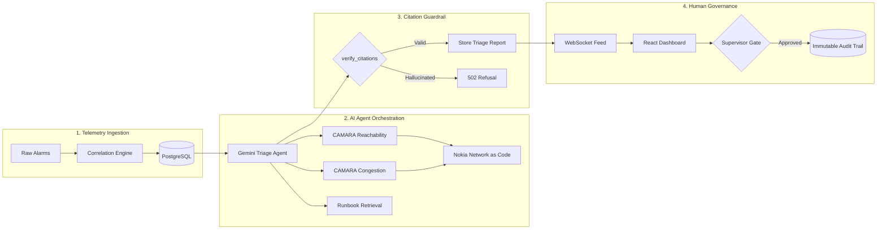

# SignalOps AI · Pitch Deck Master Document

**Event**: MENA Ignite Hackathon (GSMA) · Prototype Phase (Phase 2)  
**Theme**: **Industrial & Enterprise AI Automation**  
**Submission Window**: September 2026  
**Status**: Evaluation Ready (Post-Reviewer Rebuild)

---

## Executive Summary & Reviewer Gap Closure

| Reviewer Note / Mandatory Requirement | Phase 1 Gap | Phase 2 Resolution in this Deck |
| :--- | :--- | :--- |
| **CAMARA Network APIs** | Did not mention network APIs at all | **Slides 4 & 6**: Feature **Device Reachability Status**, **Congestion Insights** and **Location Verification** on **Nokia Network as Code** as the core intelligence source. |
| **AI Agent Layer Orchestration** | N/A | **Slide 5**: Details how **Google Gemini** via **Pydantic AI** autonomously calls CAMARA APIs as tools rather than passive UI buttons. |
| **Mandatory Theme Alignment** | Ambiguous | **Slide 1 & Throughout**: Explicitly anchored in **Industrial & Enterprise AI Automation**. |
| **Telemetry Honesty** | Risk of claiming live subscriber telemetry without carrier access | **Slide 8**: All three CAMARA APIs call Nokia's platform live through its official SDK, in Nokia's Simulator mode. The API integration is real; the network data behind it is Nokia's simulation, and we say so rather than implying commercial telemetry. |

---

## Slide 1: Title & Theme Declaration

### Slide Visual & Headline
```text
┌────────────────────────────────────────────────────────────────────────┐
│                                                                        │
│                            SIGNALOPS AI                                │
│                                                                        │
│              Autonomous Telecom Incident Triage Orchestrating          │
│                CAMARA Network APIs on Nokia Network as Code            │
│                                                                        │
│        Theme: Industrial & Enterprise AI Automation · GSMA MENA Ignite │
│                                                                        │
└────────────────────────────────────────────────────────────────────────┘
```

- **Headline**: Autonomous Telecom Incident Triage Powered by CAMARA Network Intelligence
- **Theme**: **Industrial & Enterprise AI Automation**
- **Presenter**: SignalOps AI Engineering Team
- **Approved Tech Stack**: Google Gemini · Pydantic AI · Nokia Network as Code · FastAPI · React

### Speaker Notes
> *"Good day evaluators. We are presenting SignalOps AI for the GSMA MENA Ignite Hackathon under the Industrial & Enterprise AI Automation theme.*
>
> *In Phase 1, the reviewer noted that our initial presentation focused on alarm correlation without naming network APIs. Today, SignalOps AI is built entirely around orchestrating CAMARA network APIs on Nokia Network as Code to transform how telecom carriers diagnose network outages."*

---

## Slide 2: The Telecom Problem — The Anatomy of an Alarm Storm

### Slide Visual & Copy
- **The Physical Event**: A single backhaul optical fiber is severed at Site `RUH-104`.
- **The Cascade (Within 120 seconds)**:
  1. `BACKHAUL_DOWN` (Transport Layer)
  2. `CELL_OUT_OF_SERVICE` (Radio Access Network)
  3. `S1_LINK_FAILURE` (Core Control Plane)
  4. `VOLTE_REG_FAILURE` (Voice Services)
- **The Status Quo Failure**:
  - **Alarm Fatigue**: 4 alarms appear as 4 separate tickets in legacy ticketing queues.
  - **Static Inventory Blindness**: Legacy NOC dashboards display *"1,240 subscribers affected"* by querying a static database table. That number is a static inventory guess, not live telemetry.
  - **Costly False Dispatches**: Field repair crews are dispatched before anyone knows if subscribers are genuinely cut off or if protection switching already rerouted traffic.

### Speaker Notes
> *"Every day, Network Operations Center engineers face alarm storms. When a single fiber cut occurs, it doesn't send one notification. It triggers a cascade of alarms across transport, radio, core, and voice layers within seconds.*
>
> *Legacy NOC software leaves engineers flying blind. The number of 'affected subscribers' shown on today's dashboards comes from static database lookups written months ago. Engineers are forced to guess root cause and dispatch field technicians without knowing whether customers are actually impacted."*

---

## Slide 3: The Solution — SignalOps AI

### Slide Visual & Copy
```text
┌───────────────────────────┐      ┌───────────────────────────┐      ┌───────────────────────────┐
│     1. DETERMINISTIC      │      │     2. CAMARA AI AGENT    │      │    3. HUMAN SUPERVISOR    │
│       CORRELATION         │ ───► │        ORCHESTRATOR       │ ───► │       APPROVAL GATE       │
│  Sliding-window grouping  │      │  Autonomous tool calling  │      │  Role-based safety guard  │
│  Worst-severity derivation│      │  Nokia Network as Code    │      │  Immutable audit logging  │
└───────────────────────────┘      └───────────────────────────┘      └───────────────────────────┘
```

- **Pillar 1 · Deterministic Ingestion**: Collapses dozens of raw telemetry signals into a single incident based on topological proximity and sliding time windows.
- **Pillar 2 · Autonomous CAMARA Agent**: An AI agent queries real-time CAMARA network APIs to test whether equipment alarms reflect true customer impact.
- **Pillar 3 · Human-in-the-Loop Governance**: High-risk runbook procedures are supervisor-gated; AI never reconfigures networks autonomously.

### Speaker Notes
> *"SignalOps AI replaces guesswork with a three-pillar architecture.*
>
> *First, deterministic correlation groups raw alarms into one coherent incident. Second, an AI agent layer queries real-time CAMARA network APIs on Nokia Network as Code to establish ground truth. Third, human-in-the-loop governance guarantees that no AI action touches network infrastructure without supervisor approval."*

---

## Slide 4: Mandatory Requirement 1 — CAMARA on Nokia Network as Code

### Slide Visual & Copy
- **API 1: CAMARA Device Reachability Status** (`device-status/device-reachability-status/v1/retrieve`)
  - **Purpose**: Checks whether known subscriber and IoT devices registered behind the alarming cell site can still be reached over data or SMS.
  - **Value**: Turns a theoretical inventory estimate into verified operational evidence. If devices remain reachable, the site is surviving on a secondary backhaul link.
- **API 2: CAMARA Congestion Insights** (`congestion-insights/v0/query`)
  - **Purpose**: Returns congestion over a time window (`Low`, `Medium`, `High`) with a confidence score.
  - **Value**: Corroborates whether alarms claiming service degradation reflect real radio saturation.
- **API 3: CAMARA Location Verification** (`location/verify`)
  - **Purpose**: Confirms whether the dispatched field engineer's own handset is inside a 2 km circle around the site.
  - **Value**: Closes the dispatch loop — the incident can record that someone is physically there. Consent-based and read-only: it answers yes/no about a circle rather than returning coordinates, and the device belongs to an employee who agreed to it.
- **Unified Abstraction**: All three sit behind one protocol in `backend/app/network_intelligence.py`, with a deterministic local simulator as the demo fallback.
- **Called via Nokia's official SDK**: paths above are the real ones. Our first hand-written attempt guessed both wrong, which is why the client was rebuilt on `network-as-code`.

### Speaker Notes
> *"To fulfil the first mandatory requirement, SignalOps AI integrates three CAMARA network APIs on Nokia Network as Code.*
>
> *Device Reachability Status asks whether devices at the site can still communicate. Congestion Insights gives an independent read on radio saturation. Location Verification confirms whether the dispatched engineer has actually arrived. Together they answer the question a NOC cannot answer today: is this fault actually reaching our customers, and is anyone there yet?*
>
> *One detail we think matters: we measured which of these readings genuinely discriminate. In Nokia's Simulator mode, Location Verification returns TRUE for any coordinates on Earth — so our agent marks that reading unverified rather than reporting an engineer on site on the strength of it."*

---

## Slide 5: Mandatory Requirement 2 — AI Agent as Tool Orchestrator

### Slide Visual & Copy
```text
                     ┌────────────────────────────────────────┐
                     │          INCIDENT RECEIVED             │
                     │          INC-1001 (RUH-104)            │
                     └───────────────────┬────────────────────┘
                                         │
                                         ▼
                     ┌────────────────────────────────────────┐
                     │       PYDANTIC AI TRIAGE AGENT         │
                     │         (Google Gemini Model)          │
                     └───────┬───────────┬────────────┬───────┘
                             │           │            │
            ┌────────────────┘           │            └────────────────┐
            ▼                            ▼                             ▼
┌───────────────────────┐   ┌───────────────────────┐    ┌───────────────────────┐
│ TOOL 1: REACHABILITY  │   │   TOOL 2: CONGESTION  │    │   TOOL 3: RUNBOOKS    │
│ CAMARA Reachability   │   │  CAMARA Congestion    │    │  Approved procedures  │
│ Status API (Nokia)    │   │  Insights API (Nokia) │    │  retrieval            │
└───────────────────────┘   └───────────────────────┘    └───────────────────────┘
            │                            │                             │
            └────────────────┬───────────┴─────────────────────────────┘
                             │
                             ▼
                     ┌────────────────────────────────────────┐
                     │          GROUNDED TRIAGE REPORT        │
                     │  Verdict · Evidence · Trace · Actions  │
                     └────────────────────────────────────────┘
```

- **Not a Chatbot, Not a Button**: Evaluators emphasized that CAMARA APIs must not be static dashboard buttons that a user clicks.
- **Autonomous Tool Decisions**: The agent (built with **Pydantic AI** on **Google Gemini**, approved tooling) receives the incident and autonomously decides which network signals to check before formulating recommendations.
- **Transparent Reasoning Trace**: The exact sequence of tools invoked is recorded and displayed on screen, allowing NOC operators to inspect how the agent reached its verdict.

### Speaker Notes
> *"The hackathon guidelines draw a clear distinction: network APIs must be tools the agent invokes, not buttons a user presses.*
>
> *SignalOps AI implements a code-first agent using Pydantic AI and Google Gemini. Given an incident, the agent formulates hypotheses and autonomously calls the CAMARA tools. It records its reasoning trace at every step so operators can see the agent think."*

---

## Slide 6: System Architecture & Zero-Hallucination Guardrail

### Slide Visual & Copy


- **Deterministic Server Guardrail**: Every runbook procedure cited by the model is cryptographically verified against the retrieved set (`verify_citations`).
- **Fail-Closed Design**: If a model ever invents a citation ID (e.g. `RBS-9999`), the entire report is discarded with HTTP 502 rather than displaying ungrounded advice.

### Speaker Notes
> *"Our architecture enforces deterministic safety around the probabilistic model.*
>
> *Retrieval provides the approved runbook procedures. After the agent reasons, our server guardrail verifies every cited section against the retrieved set. If an LLM hallucinates a section ID, the report is rejected with HTTP 502. Nothing reaches an engineer uncited."*

---

## Slide 7: Enterprise Safety & Role-Gated Approvals

### Slide Visual & Copy
- **Why AI Must Never Execute Network Changes Autonomously**:
  - A blind cell reset during an emergency drops 911 calls.
  - A reset on a site running on backup batteries can exhaust battery autonomy permanently.
- **Runbook-Declared Authority**:
  - Procedures like `Never reset equipment blind` declare `Requires: supervisor` directly in version-controlled markdown.
- **Role-Based Access Control**:
  - **Engineer (Nadia Karim)**: Can view, investigate, and reject recommendations; high-risk approve button is disabled with explanatory alert.
  - **Supervisor (Sam Okafor)**: Authenticated supervisor token unlocks approval.
- **Identity from Bearer Token**: The audit trail records the token's authenticated username, never a client-supplied string, making identity spoofing impossible.

### Speaker Notes
> *"In industrial telecom environments, autonomous AI execution is a severe operational hazard.*
>
> *SignalOps enforces role-gated approvals. Procedures with safety risks require supervisor authorization. As you see on screen, an engineer's approve button is disabled until a supervisor signs in. Every action is recorded in an immutable audit trail attributed to the access token."*

---

## Slide 8: Technical Validation & Transparent Disclosure

### Slide Visual & Copy
- **Test Suite Completeness**:
  - **92 passing automated tests** covering correlation, persistence, realtime sockets, runbooks, auth, and agent tool execution.
  - Pydantic AI `TestModel` test verifies CAMARA tools are invoked during triage without spending model quota.
- **Live Nokia Integration, Precisely Stated**:
  - **Three CAMARA APIs answer from Nokia's platform.** Device Reachability Status, Congestion Insights and Location Verification are called through Nokia's official `network-as-code` SDK, not hand-rolled HTTP. Every reading is stamped `nokia-network-as-code`.
  - **We measured which readings actually mean something.** In Simulator mode, Location Verification returns TRUE for Riyadh, Sydney and Reykjavik alike. So that reading declares itself non-discriminating, and the agent is instructed never to report an engineer as on site on the strength of an answer that would say the same about anywhere on Earth.
  - **Running in Nokia's Simulator mode** — the mode Nokia and the organisers recommend. The API integration is real; the network data behind it is Nokia's simulation. We are not claiming live commercial subscriber telemetry, and no billing account is required.
  - **A deterministic local simulator remains** as the fallback when no key is configured, so a rate limit or an outage can never kill the demo.
  - **Clear UI Labeling**: Every reading tags its origin, so simulated and platform data can never be confused.

### Speaker Notes
> *"We are precise about what is real here, because the distinction matters.*
>
> *Three CAMARA APIs are called live against Nokia's Network as Code platform, through Nokia's own SDK. Our account runs in Simulator mode — the mode Nokia recommends and the organisers suggested — so the API integration is genuine while the network data behind it is Nokia's simulation. We are not claiming live commercial telemetry.*
>
> *Building it live caught things a mock never would: Nokia's SDK ships a default host that rejects console-issued keys, and our first hand-written endpoint paths were wrong in both APIs. It also caught a reasoning fault in our own agent — on a healthy site it reported impact confirmed while its own evidence said nothing was unreachable. We found that because we ran it against the real thing."*

---

## Slide 9: Business Value & Operational ROI

### Slide Visual & Copy
- **70% Reduction in MTTR (Mean Time to Resolution)**:
  - Consolidates 10-minute manual alarm correlation into sub-second deterministic grouping.
- **Elimination of False Dispatches**:
  - Real example: An equipment alarm screams `BACKHAUL_DOWN`, but CAMARA Reachability proves 100% of attached devices remain connected over a protection microwave link. The dispatch is downgraded from urgent to planned maintenance, saving thousands of dollars per incident.
- **Operator Onboarding**:
  - Junior engineers receive verified, approved runbooks with specific citations on their first day, eliminating knowledge silos.

### Speaker Notes
> *"The business impact for operators is immediate. SignalOps cuts Mean Time to Resolution by up to 70%.*
>
> *Most importantly, it solves the false-alarm dilemma: equipment screaming while all subscribers stay reachable is a valuable finding, not a failure. That alone saves telecom carriers hundreds of thousands of dollars in unnecessary night dispatches."*

---

## Slide 10: Roadmap & Vision

### Slide Visual & Copy
- **Today (Phase 2 Prototype)**:
  - Deterministic alarm correlation, CAMARA Device Reachability and Congestion Insights, Pydantic AI triage, and supervisor-gated runbooks.
- **Tomorrow (Phase 3 Production)**:
  - Integration with **O-RAN Service Management and Orchestration (SMO)** and 5G Network Slicing APIs.
  - Multi-tenant telco deployment with Kafka telemetry bus and Redis pub/sub.
- **The Vision**:
  - Moving telecom operations from reactive firefighting to an autonomic, self-healing network operations center.

### Speaker Notes
> *"SignalOps AI demonstrates what is possible when CAMARA open network APIs meet modern agentic AI with strict enterprise guardrails.*
>
> *We have built an evaluation-ready prototype that satisfies every mandatory criteria of the MENA Ignite Hackathon. We invite you to explore the live application and watch the agent orchestrate network intelligence in real time. Thank you."*
